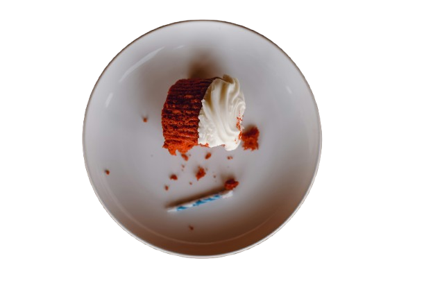
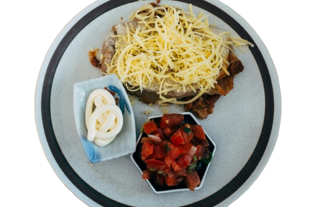
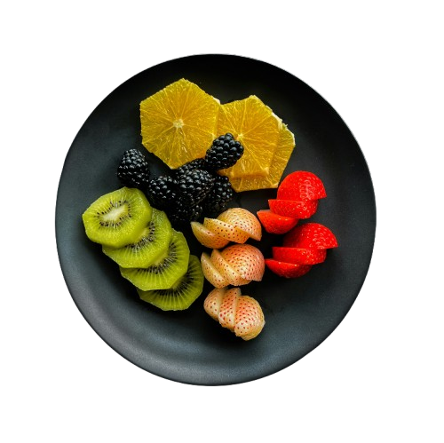

# 🍽️ RestoPro — Restaurant Management Website

A fully responsive static restaurant website built with HTML, CSS, Bootstrap, and JavaScript. Includes both a **Client-facing website** and an **Admin dashboard** for managing the restaurant.

---

## 🌐 Live Demo

🔗 [View Live Site]( https://dimpuldasari.github.io/RESTOPRO/)


---

## 📸 Screenshots

| Client Home Page | Menu Page | Admin Dashboard |
|---|---|---|
|  |  |  |

---

## 📁 Project Structure

```
resto-pro/
│
├── index.html                  # Main landing page
│
├── Client-side/                # Customer-facing pages
│   ├── index.html              # Home page
│   ├── menu.html               # Food menu
│   ├── booking.html            # Table booking
│   ├── about-us.html           # About the restaurant
│   ├── contactus.html          # Contact form
│   ├── login.html              # Customer login
│   └── register.html           # Customer registration
│
├── Admin-side/                 # Admin dashboard pages
│   ├── dashboard.html          # Overview & stats
│   ├── orders.html             # Manage orders
│   ├── bookings.html           # Manage table bookings
│   ├── menuu.html              # Manage menu items
│   ├── gallery.html            # Manage gallery
│   ├── offers.html             # Manage offers
│   └── settings.html           # Site settings
│
└── images/                     # All image assets
    ├── logo.jpg
    ├── bg.jpg
    └── ...
```

---

## ✨ Features

### Client Side
- 🏠 Responsive home page with hero section
- 🍕 Interactive food menu with categories
- 📅 Table booking form
- 👨‍🍳 Chef profiles section
- 💬 Customer testimonials
- 📞 Contact form with map
- 🔐 Login & Registration pages

### Admin Side
- 📊 Dashboard with key stats
- 📦 Order management
- 📅 Booking management
- 🍽️ Menu item management
- 🖼️ Gallery management
- 🎁 Offers & promotions
- ⚙️ Settings panel

---

## 🛠️ Technologies Used

| Technology | Purpose |
|---|---|
| HTML5 | Page structure |
| CSS3 | Styling & animations |
| Bootstrap 5 | Responsive layout |
| JavaScript | Interactivity |
| Font Awesome | Icons |
| Google Fonts | Typography (Poppins, Pacifico, Montserrat) |

---

